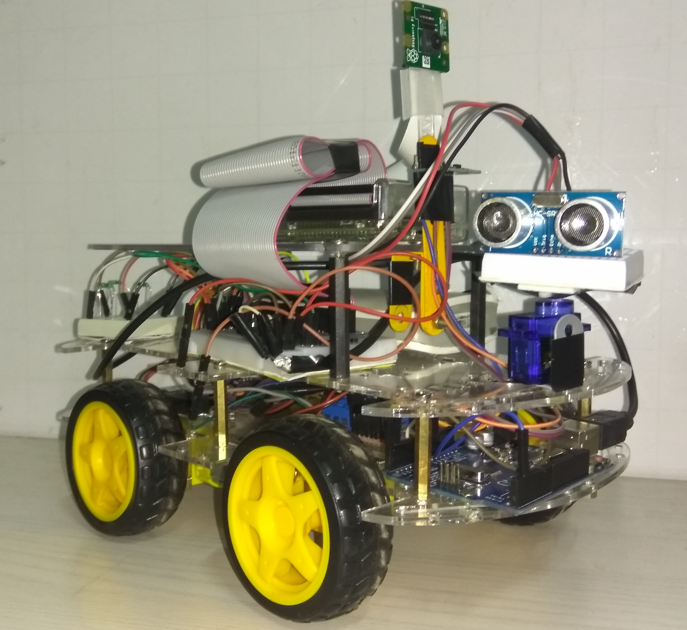
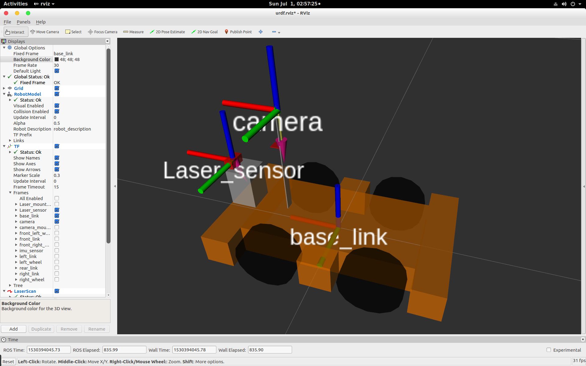
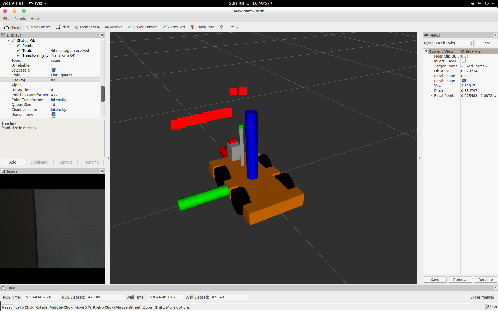
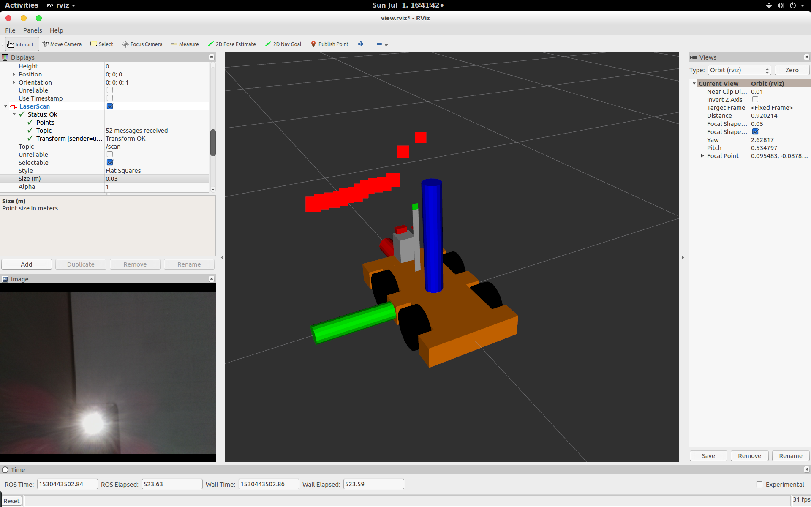
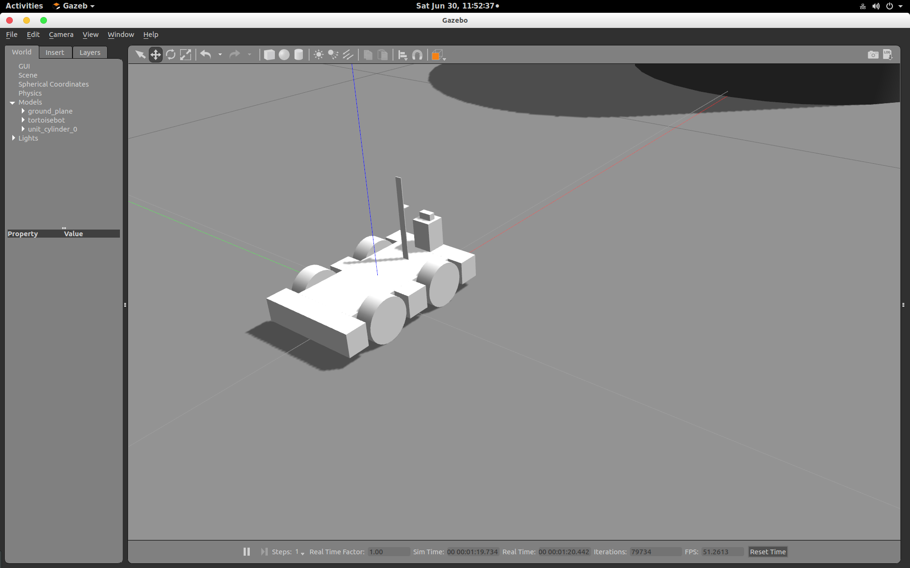
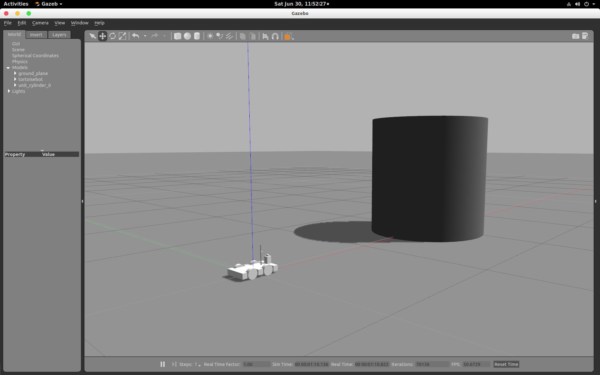

<h1>Autonomous Robot with Self Navigational Capabilities for Indoor Application based on R.O.S.</h1>

<h2>Some screenshots, images and video clip from the project</h2>

<ul>
	<li>
		<h4>Watch video clip of Final prototype</h4>
		https://github.com/c17hawke/Autonomous-Robot-with-Self-Navigational-Capabilities-for-Indoor-Application-based-on-R.O.S./blob/master/video/VID_20180706_082805.mp4
	</li>
	<li>
		<h4>Final prototype</h4>
		
	</li>
	<li>
		<h4>Screenshot of virtual model of our prototype in rviz tool</h4>
		
	</li>
	<li>
		<h4>Screenshot of virtual model of our prototype showing obstacle in front of it in rviz tool</h4>
		
	</li>
	<li>
		<h4>Screenshot of virtual model of our prototype in rviz tool with camera input</h4>
		
	</li>
	<li>
		<h4>Screenshot of virtual model of our prototype in Gazebo</h4>
		
	</li>
	<li>
		<h4>Screenshot of virtual model of our prototype in Gazebo</h4>
		
	</li>
</ul>
